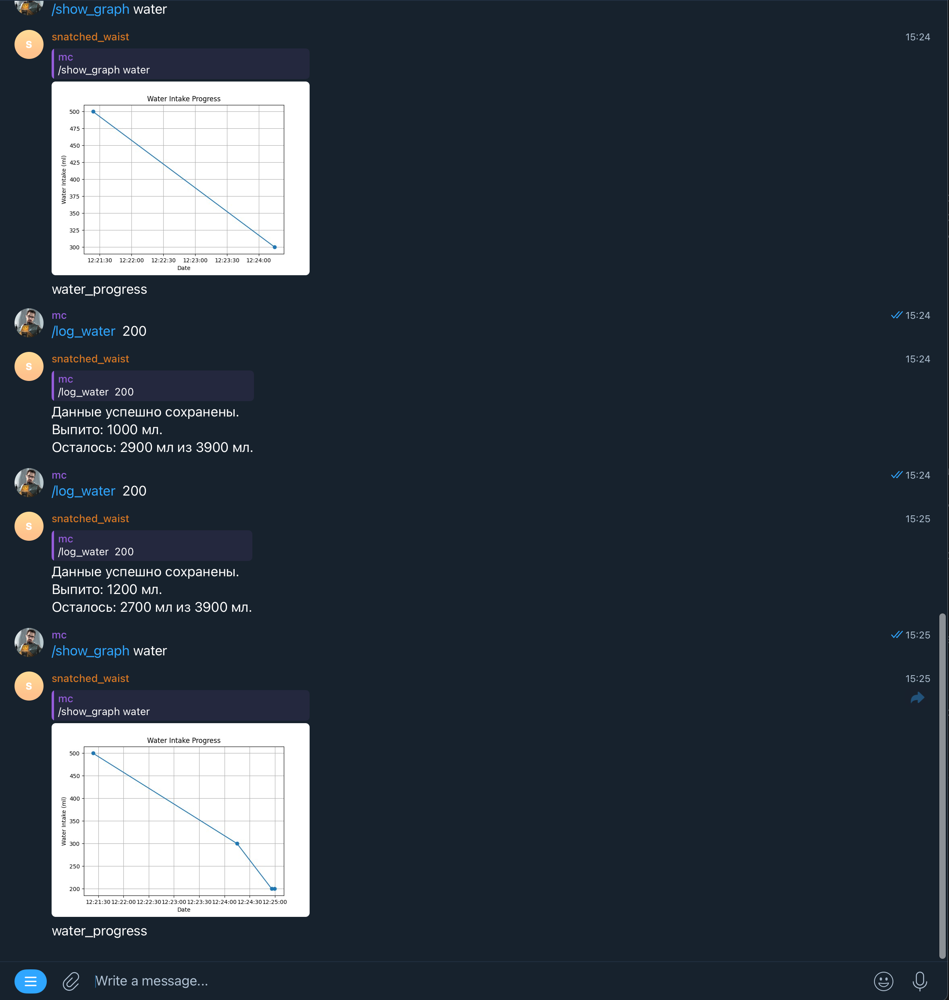

# Fitness Tracker Bot

https://t.me/snatched_waist_bot

### Публичный репозиторий проекта

https://github.com/mcccccccccc/snatched_waist_bot

Бот запущен на VPS и работает. Можно попробовать его в действии.
NB: Писал ночью, поэтому могут быть баги, отладил не до конца )

## Обзор

Fitness Tracker Bot - это Telegram-бот, предназначенный для помощи пользователям в отслеживании их ежедневной активности, потребления воды, пищи и тренировок. Бот предоставляет различные команды для записи данных, установки целей и визуализации прогресса с помощью графиков.  



### Команды

/start - Запустить бота и отобразить главное меню.

/set_profile - Настроить профиль, указав возраст, ежедневную активность и город.

/clear_profile - очистить профиль

/start_day - Начать новый день и сбросить дневные записи.

/calorie_goal <число> - Установить дневную цель по калориям (либо посчитается автоматически).

/profile - Отобразить информацию о профиле.

/log_water <количество> - Записать потребление воды в миллилитрах.

/log_food <название_еды> <вес> - Записать потребление пищи с указанием названия и веса в граммах.

/log_workout <активность> <длительность> - Записать тренировку с указанием типа и длительности в минутах.

/check_progress - Проверить прогресс за день.

/show_graph <workout, water, food> - Отобразить график прогресса для указанного типа.

### Особенности

Настройка профиля: Пользователи могут настроить свой профиль, указав возраст, ежедневную активность и город.

Дневные записи: Пользователи могут записывать потребление воды, пищи и тренировки. Чтобы начать новый день (обнулить счетчики), надо вызвать команду /start_day.

Цель по калориям: Пользователи могут установить дневную цель по калориям.

Отслеживание прогресса: Пользователи могут проверять свой прогресс и визуализировать его с помощью графиков.

Сохранение данных: Данные пользователей сохраняются и извлекаются для точного отслеживания.

Генерация графиков: Графики генерируются с использованием библиотеки matplotlib и отправляются пользователю в виде изображения.

### Хранилище данных

Для хранения данных используется локальный словарь. Уникальным ключом хранения является user_id пользователя Телеграмм.

Создан dataclass для хранения данных пользователя и его трекинга.
```python
@dataclass
class Profile:
    weight: int
    height: int
    age: int
    city: str
    activity: int
    calorie_goal: int = None
    logged_water: int = 0
    logged_calories: int = 0
    burned_calories: int = 0
    today: date = field(default_factory=date.today)
    trace_workout: List[Tuple[date, int]] = field(default_factory=list)
    trace_water: List[Tuple[date, int]] = field(default_factory=list)
    trace_food: List[Tuple[date, int]] = field(default_factory=list)
```


### Внешние запросы к API

Сделана интеграция по АПИ с сервисами:
- nutritionix.com - получение калорийности спортивных активностей 
- openfoodfacts.org - получение калорийности продуктов
- openweathermap.org - получение температуры в городе

### Middleware

Добавлен middleware для логирования запросов к боту. Через него проксируются все роуты.
Добавлен middleware для контроля того что профиль заполнен. Через него проксируются роуты группы calc_router. 

### Сборка контейнера

Поместил проект в докер. Dockerfile имеется.

Собрать контейнер:

`docker build -t mc_bot .`

Запустить контейнер:

`docker run -it --rm -d --name mc_bot_container mc_bot`

### Скриншоты

Скриншоты работы сервиса лежат в директории [pics](pics)